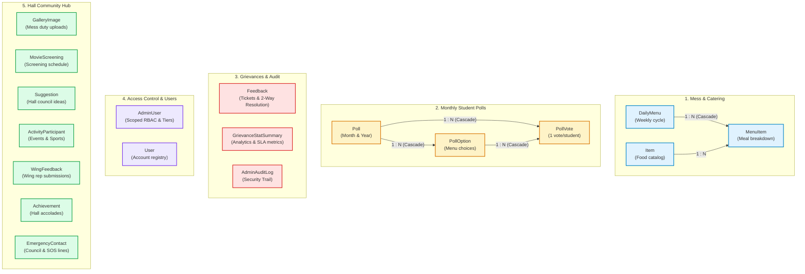

# BROS Database Schema Visualizer

This document provides a comprehensive architectural and relational visualization of the **BROS (BR Ambedkar hall Operations & Services)** PostgreSQL database schema defined via Prisma.

---

## 1. Domain Architecture Overview

The database models are organized into 5 cohesive functional domains:

---

## 2. Complete Entity-Relationship (ER) Diagram

```mermaid
erDiagram
    Item ||--o{ MenuItem : "referenced_in"
    DailyMenu ||--o{ MenuItem : "contains"
    Poll ||--o{ PollOption : "defines"
    Poll ||--o{ PollVote : "records"
    PollOption ||--o{ PollVote : "tallies"

    Item {
        String id PK "UUID"
        String name "Item name"
        Float price "Base unit price"
        String category "Breakfast, Lunch Veg, etc."
        FacilityType facilityType "Default: REGULAR_MESS"
        Boolean isMandatory "Required meal component"
        Boolean isSalad "Special salad flag"
        DateTime createdAt "Auto timestamp"
        DateTime updatedAt "Auto timestamp"
    }

    DailyMenu {
        String id PK "UUID"
        String dayOfWeek "MONDAY..SUNDAY"
        FacilityType facilityType "REGULAR_MESS"
        Float totalCost "Aggregated cost"
        DateTime createdAt "Auto timestamp"
        DateTime updatedAt "Auto timestamp"
    }

    MenuItem {
        String id PK "UUID"
        String dailyMenuId FK "Cascade on delete"
        String itemId FK "Ref Item.id"
        MealType mealType "BREAKFAST, LUNCH, etc."
        Float price "Meal price snapshot"
        String optionGroup "Common, Veg, Non-Veg"
        DateTime createdAt "Auto timestamp"
    }

    Poll {
        String id PK "UUID"
        Int month "1-12"
        Int year "e.g. 2026"
        Boolean isActive "Active voting flag"
        DateTime createdAt "Auto timestamp"
        DateTime updatedAt "Auto timestamp"
    }

    PollOption {
        String id PK "UUID"
        String pollId FK "Cascade on delete"
        String itemName "Dish / Option proposal"
    }

    PollVote {
        String id PK "UUID"
        String pollId FK "Cascade on delete"
        String pollOptionId FK "Cascade on delete"
        String rollNo "Student Roll (Unique per poll)"
        DateTime createdAt "Auto timestamp"
    }

    Feedback {
        String id PK "UUID"
        String ticketNumber UK "e.g. A-515MS1908261"
        String studentName "Author name"
        String hallRoll "Room / Roll"
        String roomNo "e.g. A-515"
        String email "Student email"
        String comment "Grievance body"
        FacilityType facilityType "Mess, Canteen, Maintenance"
        String status "UNREGISTERED, PENDING, RESOLVED, PURGED"
        String remark "Current administrative note"
        String remarkHistory "JSON stringified audit log"
        String mediaUrl "Cloudinary photo/video URL"
        String capturedAt "EXIF capture timestamp"
        String resolvedBy "Resolver name"
        String resolvedByEmail "Resolver email"
        String resolvedByRole "Resolver designation"
        DateTime resolvedAt "Resolution timestamp"
        Boolean isEscalated "Escalated priority flag"
        String escalatedBy "Admin email"
        String escalatedRemark "Escalation notes"
        DateTime escalatedAt "Timestamp"
        Boolean adminResolved "Marked resolved by Admin"
        Boolean userResolved "Marked resolved by Student"
        String overriddenBy "Master admin override email"
        DateTime overriddenAt "Override timestamp"
        String overriddenReason "Administrative override note"
        Boolean managerApproved "Countersigned by Mess Manager"
        DateTime createdAt "Auto timestamp"
        DateTime updatedAt "Auto timestamp"
    }

    AdminUser {
        String id PK "UUID"
        String email UK "Institute admin email"
        String designation "Role title"
        Boolean canOverride "Override permission"
        String tier "HIGH or LOW"
        Boolean isMaster "Master authority flag"
        Boolean canManageMess "Scope: Mess & Canteen"
        Boolean canManageMaintenance "Scope: Maintenance"
        DateTime createdAt "Auto timestamp"
        DateTime updatedAt "Auto timestamp"
    }

    AdminAuditLog {
        String id PK "UUID"
        String adminEmail "Actor email"
        String action "REGISTER_ADMIN, RESOLVE, etc."
        String details "Action summary"
        String targetId "Affected resource ID"
        DateTime createdAt "Auto timestamp"
    }

    GrievanceStatSummary {
        String id PK "UUID"
        String category UK "Facility category identifier"
        Int totalSubmitted "Count of all submissions"
        Int totalResolved "Count of resolved grievances"
        Int totalTwoWayVerified "Two-way confirmed count"
        Int totalEscalated "Count of escalated tickets"
        BigInt totalResolutionTimeMinutes "Aggregated SLA duration"
        DateTime createdAt "Auto timestamp"
        DateTime updatedAt "Auto timestamp"
    }

    User {
        String id PK "UUID"
        String email UK "Unique email address"
        String name "Display name"
        String role "STUDENT or ADMIN"
        DateTime createdAt "Auto timestamp"
        DateTime updatedAt "Auto timestamp"
    }

    GalleryImage {
        String id PK "UUID"
        String url "Cloudinary media URL"
        String caption "Image description"
        String category "CLEANING, RAW_MATERIALS, etc."
        String uploaderName "Student rep name"
        String uploaderRollNo "Student roll number"
        String capturedAt "EXIF timestamp"
        String status "PENDING, APPROVED, REJECTED"
        Boolean managerApproved "Countersigned by Mess Manager"
        DateTime createdAt "Auto timestamp"
    }

    MovieScreening {
        String id PK "UUID"
        String title "Movie title"
        String posterUrl "Poster image URL"
        DateTime showTime "Screening date & time"
        String venue "Default: Common Room"
        DateTime createdAt "Auto timestamp"
        DateTime updatedAt "Auto timestamp"
    }

    Suggestion {
        String id PK "UUID"
        String studentName "Proponent student name"
        String hallRoll "Room / Roll"
        String category "MESS, MAINTENANCE, etc."
        String content "Suggestion text"
        String targetId "Optional target reference"
        DateTime createdAt "Auto timestamp"
    }

    ActivityParticipant {
        String id PK "UUID"
        String studentName "Participant name"
        String hallRoll "Student roll number"
        String activity "Activity / Event name"
        String venue "Default: BRH Common Room"
        DateTime eventDate "Event date & time"
        String description "Event details"
        DateTime createdAt "Auto timestamp"
    }

    WingFeedback {
        String id PK "UUID"
        String wing "Wing identifier (A, B, C, D)"
        String representative "Wing representative"
        String feedbackContent "Wing collective notes"
        DateTime createdAt "Auto timestamp"
    }

    Achievement {
        String id PK "UUID"
        String studentName "Achiever student name"
        String hallRoll "Student roll number"
        String title "Award / Title"
        String description "Achievement details"
        String category "ACADEMICS, SPORTS, CULTURAL"
        DateTime date "Award date"
        DateTime createdAt "Auto timestamp"
    }

    EmergencyContact {
        String id PK "UUID"
        String role "Warden, Council, Security, etc."
        String name "Contact person name"
        String phone "Phone / Mobile number"
        Int order "Sort priority index"
        DateTime createdAt "Auto timestamp"
    }
```

---

## 3. Enumerations

### `FacilityType`
Categorizes facilities across mess services and maintenance departments:
- `REGULAR_MESS` — Main Dining Hall
- `NIGHT_CANTEEN` — Night Canteen operations
- `MAINTENANCE_WASHROOM` — Washroom plumbing & sanitation
- `MAINTENANCE_WATER` — Aquaguard & drinking water
- `MAINTENANCE_ELECTRICAL` — Wiring, lighting, fans & geysers
- `MAINTENANCE_CIVIL` — Doors, windows, masonry & carpentry
- `MAINTENANCE_CLEANING` — Corridors, rooms & waste disposal
- `MAINTENANCE_OUTDOOR` — Gym equipment & outdoor grounds

### `MealType`
Designates the meal period for menu items:
- `BREAKFAST`
- `LUNCH`
- `DINNER`
- `NIGHT_SNACK`

---

## 4. Key Relationships & Constraints Table

| Source Model | Target Model | Cardinality | Foreign Key | Cascade Behavior | Business Logic |
| :--- | :--- | :--- | :--- | :--- | :--- |
| `DailyMenu` | `MenuItem` | 1 : N | `MenuItem.dailyMenuId` | `onDelete: Cascade` | Deleting a daily menu removes all attached meal item snapshots. |
| `Item` | `MenuItem` | 1 : N | `MenuItem.itemId` | `Restricted` | Master food catalog item referenced in meal schedules. |
| `Poll` | `PollOption` | 1 : N | `PollOption.pollId` | `onDelete: Cascade` | Deleting a monthly poll purges all candidate menu options. |
| `Poll` | `PollVote` | 1 : N | `PollVote.pollId` | `onDelete: Cascade` | Deleting a poll cascades to all votes recorded for that month. |
| `PollOption` | `PollVote` | 1 : N | `PollVote.pollOptionId` | `onDelete: Cascade` | Removing a specific poll option cleans up its vote tallies. |

---

## 5. Unique Indexes & Optimization Strategy

| Model | Index Target | Type | Rationale |
| :--- | :--- | :--- | :--- |
| `DailyMenu` | `[dayOfWeek, facilityType]` | **Unique** | Enforces exactly 1 schedule per day per facility. |
| `Feedback` | `ticketNumber` | **Unique** | Format `[Room][Cat][DDMMYY][Seq]` ensures non-conflicting ticket references. |
| `Poll` | `[month, year]` | **Unique** | Restricts voting cycles to 1 poll per calendar month. |
| `PollVote` | `[pollId, rollNo]` | **Unique** | Enforces the "one student, one vote" rule per monthly poll. |
| `AdminUser` | `email` | **Unique** | Prevents duplicate administrative account registrations. |
| `GrievanceStatSummary` | `category` | **Unique** | Maintains a single aggregate row per department/facility. |
| `Feedback` | `[status]`, `[facilityType]`, `[createdAt]`, `[email]` | **B-Tree** | Accelerates student queries, admin dashboards, and lazy purge jobs. |
| `AdminAuditLog` | `[createdAt]`, `[action]` | **B-Tree** | Optimizes audit security trail searches and timeline browsing. |
